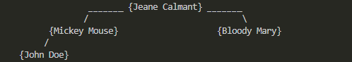

# Binary Search Tree

This implementation of a binary search tree is meant to be versatile, and easy to use.

## Setup

To use this class, all you have to do is create a new instance of it and passing it the array of data you want to process:
```ts
import { BinarySearchTree } from 'ts-bst'

const someArrayOfData: number[] = [ 18, 935, -47, 0, -1785, 5624, 3, 42, -415, 327, 98, 7 ]

const bst = new BinarySearchTree<number>(someArrayOfData)
```

And that's it, the tree is created and you have access to all its methods.

<br />

> 💡 Note:\
> *The constructor also accepts 2 functions, one to compare 2 datas, and one to stringify data nicely.*\
> *It is advised to provide them as well to get the best result out of the tree, tho it can operate without in simple cases.*
```ts
import { BinarySearchTree } from 'ts-bst'

interface IUser {
  name: string
  lastName: string,
  age: number
}

const someArrayOfData: IUser[] = [
  { name: 'John', lastName: 'Doe', age: 18 },
  { name: 'Bloody', lastName: 'Mary', age: 208 },
  { name: 'Jeane', lastName: 'Calmant', age: 123 },
  { name: 'Mickey', lastName: 'Mouse', age: 84 },
]

const compareData = (user1: IUser, user2: IUser): number => user1.age - user2.age
const dataToString = (user: IUser): string => `${user.name} ${user.lastName}`

const bst = new BinarySearchTree<IUser>(someArrayOfData, compareData, dataToString)
```

<br />

## Usage

All of the tree methods are fairly straight-forward.

Tho a thing to know is the difference between the two print methods:
- `print()`
  
  Logs the tree in a readable format, but it can quickly take a lot of screen space:

  

- `printConcise()`
  
  Logs the tree in a more barbaric way, but more concise as the name implies:

  